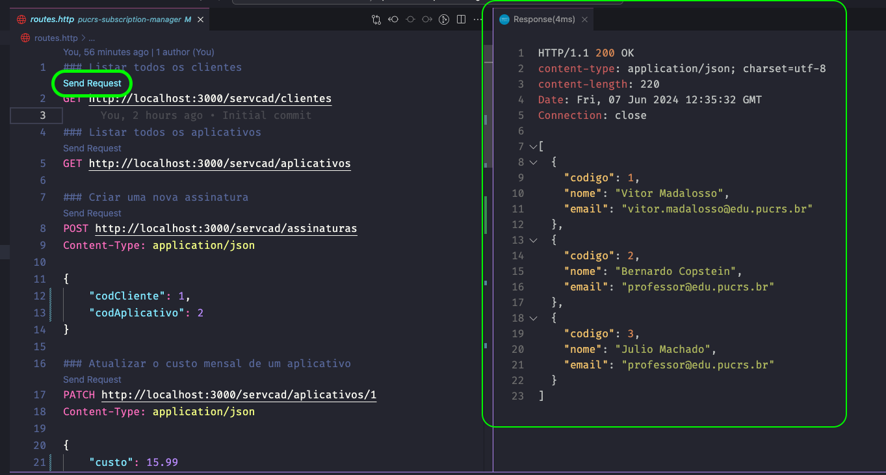

<h1 align="center">Gerenciamento de Assinaturas e Pagamentos</h1>

<p align="center">
Projeto individual para a disciplina Desenvolvimento de Sistemas Back-End - PUCRS<br/>Aluno: Vitor Madalosso<br/>
</p>

<p align="center">
  <a href="#-tecnologias">Tecnologias</a>&nbsp;&nbsp;&nbsp;|&nbsp;&nbsp;&nbsp;
  <a href="#-projeto">Projeto</a>&nbsp;&nbsp;&nbsp;|&nbsp;&nbsp;&nbsp;
  <a href="#-execução">Execução</a>&nbsp;&nbsp;&nbsp;|&nbsp;&nbsp;&nbsp;
  <a href="#memo-licença">Licença</a>
</p>

<p align="center">
  
</p>

<br>

<p align="center">
  
</p>

## 🚀 Tecnologias

Esse projeto foi desenvolvido com as seguintes tecnologias:

- Node.js + Fastify: Framework para construção dos microserviços.
- Git + GitHub: Controle de versão.
- VSCode + REST Client: Ambiente de desenvolvimento e ferramenta para testes de API.

## 💻 Projeto

Nos dias de hoje, o mercado de aplicativos para celular está em expansão, e muitas startups têm conseguido sucesso rápido com boas ideias e aplicativos baseados em assinaturas. Neste contexto, a proposta deste projeto é criar um sistema que gerencie assinaturas e pagamentos de forma eficiente.

<h3>Objetivo Geral</h3>

Desenvolver um sistema para a gestão de assinaturas de aplicativos que permita:

- Manter a lista de assinaturas de cada cliente.
- Gerar listas de cobrança e gerenciar o status das assinaturas.
- Fornecer informações sobre a validade das assinaturas para aplicativos, decidindo se devem continuar funcionando ou se devem ser bloqueados.

<h3>Objetivos Específicos</h3>

- Aplicar conhecimentos de arquitetura limpa proposta por Robert Martin.
- Implementar a comunicação entre microserviços, tanto de forma síncrona quanto assíncrona.
- Integrar serviços utilizando uma API Gateway.

## 🔖 Execução

<h3>Clone o repositório</h3>
Para clonar o repositório, utilize o comando abaixo:

```
git clone https://github.com/vmadalosso/pucrs-subscription-manager.git
```

<h3>Instalação das dependências</h3>
Acesse o diretório /pucrs-subscription-manager e, em seguida, entre nos diretórios de cada microserviço para instalar as dependências:

```
cd servico-cadastro
npm install
cd ../servico-assinaturas-validas
npm install
cd ../servico-pagamento
npm install
cd ../api-gateway
npm install
```

<h3>Execução dos Serviços</h3>
Inicialize cada serviço em uma aba separada do terminal:

```
cd servico-cadastro
npm start
```

```
cd servico-assinaturas-validas
npm start
```

```
cd servico-pagamento
npm start
```

```
cd api-gateway
npm start
```

<h3>Testes dos Endpoints</h3>
Para testar os endpoints, utilize o plugin REST Client dentro do VSCode. Com ele, você pode executar requisições GET, POST, PATCH, e outros, diretamente no VSCode, sem necessidade de configurar ferramentas como Insomnia ou Postman. Mais detalhes estão disponíveis no PDF anexado aos arquivos entregues pela plataforma da PUCRS Online.



## 📝 Licença

Esse projeto está sob a licença MIT.

---

Feito com ♥ by Vitor Madalosso 👋
